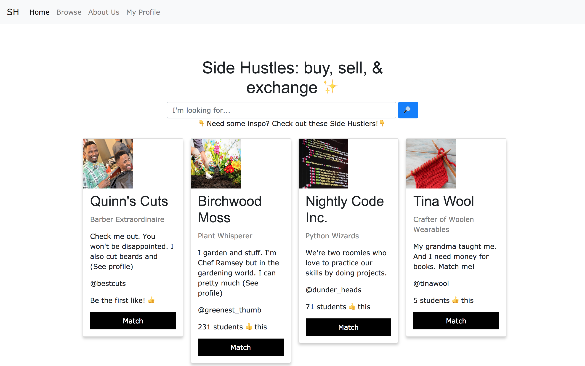
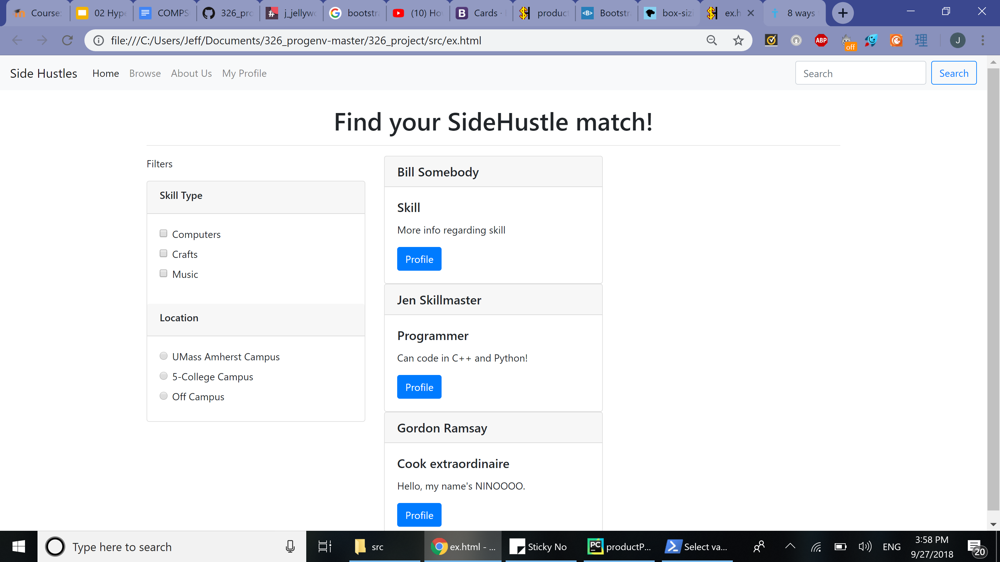
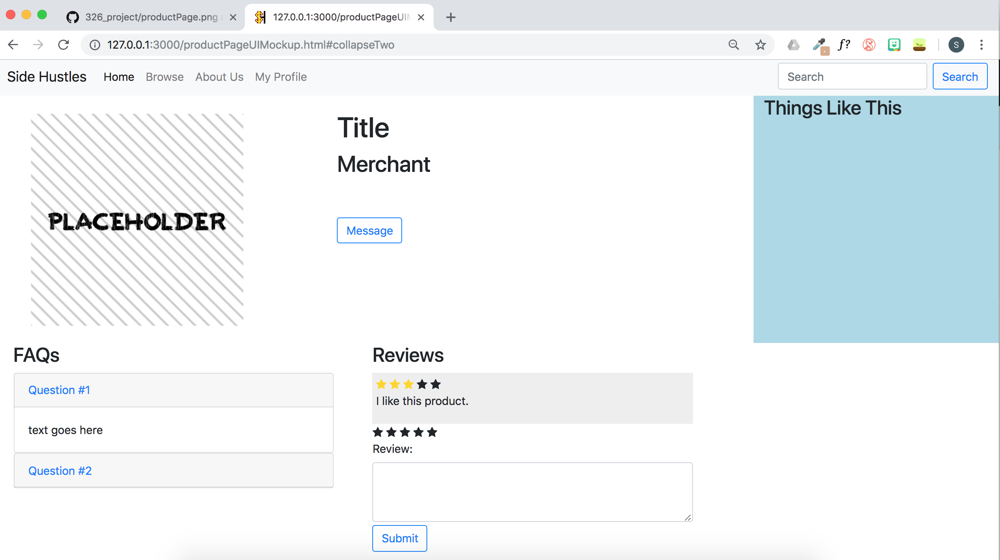

# Jellyworks

## Side Hustles 

### Team Overview

* Sarah Manlove, @smanlove29
* Edwood Brice, @edwoodbrice
* Chinh Do, @damakos
* Suzy Balles, @suzyballes
* Jeff Reardon, @JeffreyReardon

### Innovative Idea

Our idea is to create an web app called Side Hustles that allows students to practice their skills (such as cutting hair, designing websites, sewing help, creating greeting cards etc.) and also purchase products or services at an amateur rate or through an exchange of goods or services. 

This application pulls inspiration from Etsy and Amazon. Etsy, as an amateur-focused ecommerce site, is the closest inspiration for Side Hustles. However, Jellyworks aims to narrow the focus of Etsy even more to cater specifically to the college audience with the emphasis on buying from students in the user's area. We drew UI inspiration from Amazon, specifically around the product pages such as with our "Things Like This" section in our product page. 

### Important Data

Side Hustles is a web application that will enable students to purchase, sell, and exchange goods and services. As a result, it will make use of data that will promote transparency and convey information regarding the products and services that are available on the platform. Subsequently, the application will primarily handle data produced by users.  

User reviews (1) will provide salient insight that will either validate or challenge the validity of what is being offered. “Likes” (2) will enable users to see what their peers on the platform take an interest in, enjoy, support, and etc. Product and service descriptions (3) will allow merchants to describe what they are offering; for users who are interested in buying or exchanging, it will enable them to determine which merchant they should patronize. Photos of the products and services (4) will visually supplement the descriptions written by the merchants. Questions (5)—submitted by the users and answered by the merchants—will enable the latter party to have an active record of questions that will support their efforts and clarify common issues that other users may have. 

### User Interface

The first thing users will see is the landing page. In the center of the page is a search bar and below that is a scrollable row of items that are trending or popular with other users. There is a navigation bar with the logo of our site and a user icon in the right corner. All pages on this site will support a nav bar. 

The profile (user) page has a photo of the user and user information next to the picture (such as username which also includes NetID, first name and last name). It’s like a user settings page and you can change your email settings, password, and displayed major. 

The about/goals page has our logo in the center of the page and features a short blurb of what this site is for and the contact information for each of the creators. 

The browse page is a linked to the search bar on the landing page. There’s still a search bar but it will then list users and products related to the search term(s). A sidebar will list search/result options (like filters, availability, skill, etc.). 

The last page is the product description page. It features image(s) of the product or service offered, the name of what’s being offered, the seller’s name, a brief description of the product/service, FAQs, reviews, and similar products/services on the side.

# User Interface Screenshots 

### Side Hustles Landing Page

### Profile Page

### Goals / About Us Page

### Browse 

### Product & Services Description Page

